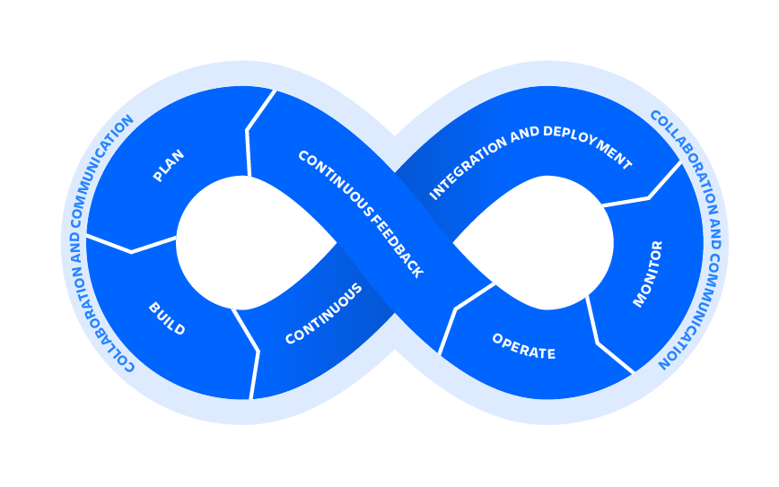

# What is DevOps?

DevOps is a set of practices that works to automate and 
integrate the processes between software development and IT 
teams, so they can build, test, and release software faster 
and more reliably. The term DevOps was formed by combining the
 words “development” and “operations” and signifies a cultural 
 shift that bridges the gap between development and operation 
 teams, which historically functioned in siloes.
 

# The roadmap to become Junior DevOps engineer in 

## #1 - Linux basics

### Commands to learn

 You can choose any distro you want. You can try all of them with vmware or virtualbox. Ubuntu or Pop is good option to start with.

- Version Control
    - git 
      - git add 
      - git commit
      - git pull
      - git fetch
      - git branch
      - git checkout
      - git push
      - git remote
      - git revert
      - git merge
- User permissions and management
    - adduser
    - usermod
    - chown
    - chmod
- Process management
    - ps
    - top / htop
    - netstat
    - lsof
    - kill
    - pkill
- Text manipulation
    - cat
    - grep
    - vim (vimtutor at least 5 times)
    - unix pipelining 
    - xarg
    - awk
- File, Dir management
    - rm
    - mv
    - sed
    - cp
    - ranger
- Disk
    - df
    - du
    - ncdu
- Folders
    - /etc
    - /var/log
    - /home
    - $PATH
    - aliases ( .zshrc )
  
### Shell scripting

- Watch any shell script tutorial on youtube, read articles.
    - You must know  to write logical functions with above linux commands.
- Try to do below tasks:
    - 1
    - 2

### Books to read

-  Linux Bible last edition

## #2 Scripting language - Python 3

You should understand Python basics, how it works, manipulation with files, dirs, unix commands and etc.

You must read the book in repo - Python for Devops from 

- Complete the tasks below and you can go further, no need to read the whole book in this part of roadmap. Get familiar with Python and continue reading it.
    - 1.
    - 2. 
 
## #3 - SSH

- pem files 
- Generate keys 
- key file permissions 
- Private and public keys 
- COPY files by ssh scp/ rsync
- Run remote shell script 
- Connect to database ssh 
- ssh tunneling

## Skills #3 - Networking protocols theory

- TCP / IP
- OSI Model
- Domains 
- HTTP / HTTPS 
- FTP
- Mailiing protocols
- TCP / UDP

## Skills #4 - Web server

- Web server base concepts 
- config files / logfiles
- Reverse proxy 
- HTTPS - certbot 
- Load balancing

## Skills #5 - IaaC

- Virtualization / containerinzation 
- 12 factors 
- Writing dockerfiles 
- docker images: 
    - build 
    - pull 
    - push
    - registry login / logout 
- Containers 
    - run 
    - logs 
    - volumes 
    - inspect 
    - execute into container 
    - run from image 
- Networking
- docker-compose 
    - write 
    - build 
    - docker compose service discovery 
    - docker compose up / down 
- Swarm / Kubernetes 
    - kubernetes theory 
    - service concept
    - service discovery
    - stack 
    - stack deploy 
    - inspect service 
    - service update (add env, remove env, update image, —with registry auth) 
    - service rollback 
    - scaling (theory)

## Skills #6 - CI

- Pipeline tasks (migrations, build, test, code analyse and etc) 
- Builing docker image in docker. Using and theory 
- Working with registry push/pull/ login/logout 
- CI/ CD

## Skills #7 - Monitoring

- Monitoing theoury. Pull, push  models 
- Prometheus exporters 
- Prometheus Query Language 
- Using Grafana 
- Alerts

## Skills #8 - Log management

- Logging format, how to log application, properly 
- Log parsing fluentbit, elastic beats 
- Elastic search 
- Kibana

## Skills #9 - Cloud

- AWS
- IAM 
- EC2
- S3 
- RDS 
- LAMBDA / Serverless 
- Cloud registries 
- Elastic Beanstalk 
- Virtual private cloud (Amazon)
- VDS/VPS hypervisor

##### Besides, all of this above, you should totally understand version control system (Git).

##### Good luck!
